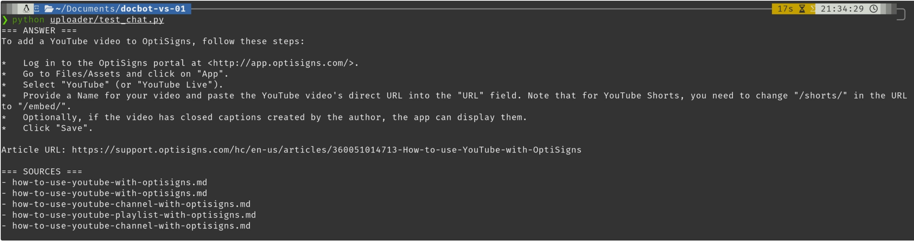

# DocBot VS-01

Clone of OptiSigns' OptiBot support assistant, built on Google Gemini File Search.

## Setup

1. Clone the repository.

2. Copy the environment file.

```bash
cp .env.sample .env
```

3. Add your `GEMINI_API_KEY` to `.env`.

4. Install dependencies.

```bash
pip install -r requirements.txt
```

5. Create a Gemini File Search Store.

```bash
python uploader/create_store.py
```

6. Copy the generated `FILE_SEARCH_STORE_NAME` into `.env`.

---

## Run locally

Run the project with:

```bash
python main.py
```

This will:

- Scrape articles from `support.optisigns.com`
- Convert HTML to Markdown
- Detect new or updated articles using SHA-256 hashes
- Upload only the delta to the Gemini File Search Store


---

## Statistics

- Articles scraped: **405**
- Files indexed in File Search Store: **405**

---

## Daily Job

Runs automatically every day at **03:00 UTC** using GitHub Actions.

Workflow:

`/.github/workflows/daily.yml`

Latest runs:

`https://github.com/NguyenKhanh0209/docbot/actions`

---

## Sample Result

The assistant correctly answers the sample question with article citations.



---

## Notes

- Uses the Gemini API Free Tier.
- API keys are managed through environment variables or GitHub Secrets.
- No secrets are hard-coded in the repository.